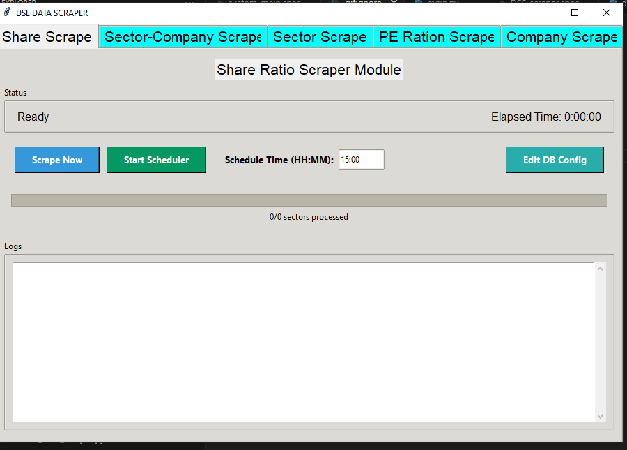

# DSE SCAPER - Dhaka Stock Exchange Data Scraper

DSE SCAPER is a Python-based web scraping tool designed to collect essential stock market data from the Dhaka Stock Exchange (DSE). This project automates the extraction of company profiles, sector lists, PE ratios, and shareholding patterns, making it easy for investors, analysts, and researchers to gather financial insights.

## Features
- **PE Scraper**: Automatically gathers detailed information on listed companies' Price-to-Earnings (PE) ratios from DSE, helping in stock valuation analysis.

- **Company Scraper**: Scrapes a complete list of all companies listed on the Dhaka Stock Exchange (DSE) with key details, useful for market research and investment strategies.

- **Sector Scraper**: Extracts all sector names and their related data from DSE, aiding in sector-wise investment analysis.

- **Share Ratio Scraper**: Collects comprehensive data about each company's total shares, along with a breakdown of ownership among sponsors, government, institutions, and public shareholders.
  
## Installation

### Prerequisites

- Python 3.7+
- Required Python packages (see `requirements.txt`)

### Setup

1. Clone the repository:
   ```
   git clone https://github.com/mdsayem01k/DSE-SCAPER.git
   cd DSE-SCAPER
   ```

2. Install dependencies:
   ```
   pip install -r requirements.txt
   ```

## GUI Preview

The application includes a user-friendly interface for scraping and scheduling tasks.



### GUI Features

- **Tabbed Navigation**: Switch between modules like Share Scrape, Sector-Company Scrape, Sector Scrape, PE Ratio Scrape, and Company Scrape.
- **Status Display**: Shows current status (e.g., Ready, Running) and elapsed time.
- **Manual & Scheduled Scraping**:
  - Click **Scrape Now** to manually trigger data scraping.
  - Set a time and click **Start Scheduler** to automate scraping.
- **Log Output**: View logs and scraping status directly in the application.
- **Database Configuration**: Easily configure DB settings using the **Edit DB Config** button.

> 🛠 Built with `Tkinter` for a responsive and intuitive desktop interface.

## Contributing

Contributions are welcome! Please feel free to submit a Pull Request.

1. Fork the repository
2. Create a feature branch (`git checkout -b feature/new-feature`)
3. Commit your changes (`git commit -m 'Add some feature'`)
4. Push to the branch (`git push origin feature/new-feature`)
5. Open a Pull Request

## License

This project is licensed under the MIT License - see the LICENSE file for details.

## Disclaimer

This tool is for educational and research purposes only. Users are responsible for ensuring their usage complies with DSE's terms of service and relevant regulations regarding web scraping and data usage.

## Author

- **Md Sayem** - [mdsayem01k](https://github.com/mdsayem01k)

## Acknowledgments

- Dhaka Stock Exchange for providing the public data interface
- Contributors and the open-source community
